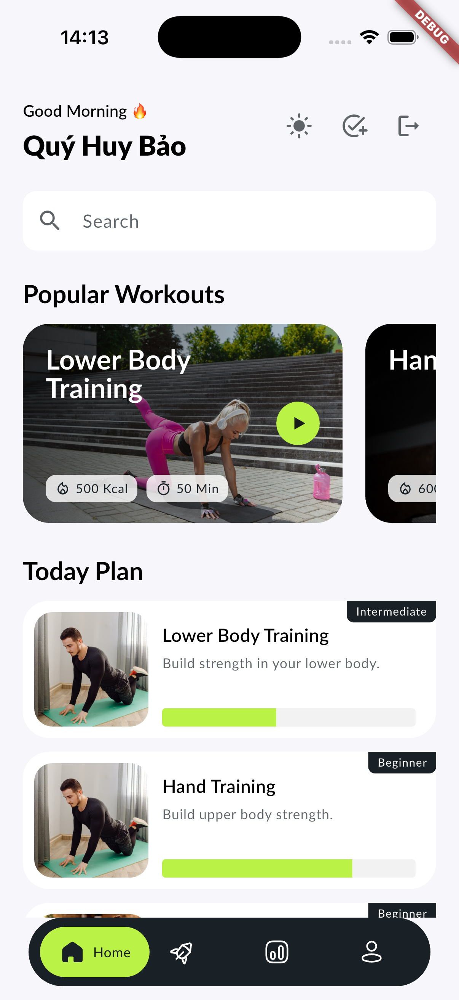

# Báo cáo cải thiện trụ cột kỹ thuật - Tháng 8 năm 2026

## Cách đọc báo cáo

Mỗi trụ cột có bốn loại bằng chứng:

- **Kế hoạch:** tôi dự định học và làm gì.
- **Evidence:** lệnh chạy, test và kết quả đo.
- **Nhật ký:** tôi đã làm gì mỗi ngày.
- **Vlog:** khó khăn và kinh nghiệm viết lại bằng lời dễ hiểu.

## 3. Data & Database - M1

### Mục tiêu

- Đọc `EXPLAIN ANALYZE` và tự tối ưu index.
- Làm Redis cache-aside có TTL, invalidation và chống cache stampede.
- Viết migration `upgrade/down`, thực hành rollback và hiểu rủi ro.

### Kết quả đã đạt được

| Nội dung | Kết quả | Bằng chứng |
| --- | --- | --- |
| PostgreSQL + Alembic | Đã setup schema, migration up/down và chạy lại migration sau rollback | [Evidence migration và index](/library/engineering/data-api-evidence/) |
| Seed dữ liệu | Đã seed ít nhất 1.000 user/workout ở local | [Kế hoạch Data/API](/library/plans/2026-08-24-data-api/) |
| `EXPLAIN ANALYZE` | Đã đo Home, history và leaderboard; leaderboard dùng covering index và `Index Only Scan` trong lần đo local | [Evidence Data/API](/library/engineering/data-api-evidence/) |
| Redis cache-aside | Leaderboard có TTL 60 giây, xóa cache sau workout và lock ngắn để tránh cache stampede | [Kế hoạch Data/API](/library/plans/2026-08-24-data-api/) |
| Rollback | Đã rollback migration index rồi upgrade lại; rủi ro mất dữ liệu và lock đã được ghi lại | [Evidence migration và index](/library/engineering/data-api-evidence/) |

### Điều tôi đã cải thiện

Trước đây tôi chưa từng đọc execution plan thực tế. Sau slice này, tôi đã biết nhìn vào loại scan, index được dùng và sự khác nhau giữa một query chạy được với một query có thể chịu tải lớn hơn.

Tôi cũng hiểu cache không chỉ là `get` rồi `set`. Cần có thời gian sống, thời điểm xóa cache, lock khi nhiều request cùng hụt cache và test cho từng tình huống.

### Việc còn cần củng cố

- Đo lại benchmark với dữ liệu lớn hơn và lưu before/after rõ hơn.
- Thực hành rollback khi có request đang chạy và khi migration thất bại giữa chừng.
- Bổ sung test PostgreSQL thật cho transaction workout, không chỉ dùng repository fake.

## 4. API Design & Integration - M2

### Mục tiêu

- Tự implement rate limiting theo user bằng Redis sliding window.
- Hiểu flow OAuth2 và xác thực Firebase/Google; chuẩn bị backlog cho Facebook/LINE.
- Chuẩn hóa response `{ data, meta, error }` và tạo OpenAPI/Swagger.

### Kết quả đã đạt được

| Nội dung | Kết quả | Bằng chứng |
| --- | --- | --- |
| Rate limiting | Tự viết sliding window bằng Redis: GET 100/phút, POST 10/phút theo user | [API contract](/library/engineering/api-contract/) |
| Firebase/Google auth | Mobile đăng nhập Google, Backend verify Firebase ID token và upsert user | [Daily Backend 20/8](/daily/backend/2026-08-20-dashboard-home/) |
| Response envelope | Các API dùng `{ data, meta, error }`, gồm cả lỗi 401, 404, 422 và 500 | [API contract](/library/engineering/api-contract/) |
| OpenAPI/Swagger | FastAPI tự sinh OpenAPI; contract test kiểm tra schema success/error | [API contract](/library/engineering/api-contract/) |
| Mobile integration | Home, Leaderboard và Log workout đã gọi API thật trên iOS Simulator | [Vlog Log workout](/library/journal/log-workout-mobile-vlog/) |

### Điều tôi đã cải thiện

Tôi không còn xem API chỉ là một URL để gọi. Tôi đã hiểu thêm về identity boundary, response contract, rate limit, idempotency và cách để Mobile không tự lặp lại business rule của Backend.

### Việc còn cần củng cố

- Vẽ lại flow OAuth2/Firebase bằng sơ đồ sau khi hoàn tất từng provider.
- Chưa có credential thật cho Facebook và LINE, nên hai provider này vẫn là backlog.
- Bổ sung test integration có Database và Redis thật cho toàn bộ flow Mobile -> API -> cache.

## Bài học lớn nhất trong tháng

Lỗi khó nhất không nằm ở một màn hình riêng lẻ. Nó nằm ở chỗ các hệ thống gặp nhau: URL local, Firebase token, enum API, Database transaction, Redis và process đang chạy.

Tôi học được cách đi từ lỗi trên simulator xuống log Backend, rồi từ traceback quay lại đúng dòng code cần sửa. Đây là kỹ năng tôi muốn tiếp tục luyện ở các feature sau.

## Liên kết tổng

- [Kế hoạch vertical slice tháng 8](/library/plans/2026-08-19-august-vertical-slice/)
- [Kế hoạch Data, Database và API](/library/plans/2026-08-24-data-api/)
- [Evidence Data và API](/library/engineering/data-api-evidence/)
- [API contract và OpenAPI](/library/engineering/api-contract/)
- [Daily Backend](/daily/backend/)
- [Daily Mobile](/daily/mobile/)
- [Vlog Leaderboard Mobile](/library/journal/leaderboard-mobile-vlog/)
- [Vlog Log workout Mobile](/library/journal/log-workout-mobile-vlog/)

## Bằng chứng trực quan

Ảnh dưới đây là ảnh chụp thật từ iPhone 17 Simulator sau khi đăng nhập Firebase và tải thành công Home Dashboard.

Các ảnh `Log workout`, kết quả lưu thành công và Leaderboard sau khi cập nhật sẽ được bổ sung sau khi tôi điều hướng thủ công đến từng màn hình trên Simulator.
