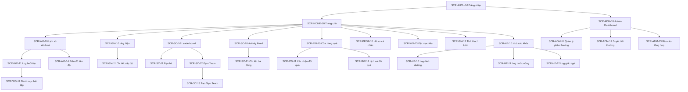
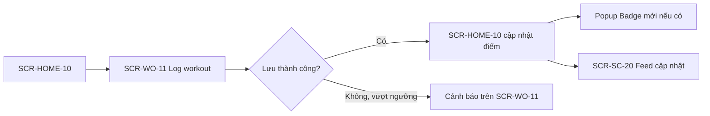

# Screen Flow / Sitemap — HealthStride

> **Trạng thái**: Draft
> **Cập nhật lần cuối**: 2026-08-10
> **Owner**: BA/PM
> **Nguồn chính**: `business-understanding.md`, `usecase-overview.md`
> **Mức coverage nguồn**: `partial` — dựa trên mô tả tính năng, chưa có wireframe/mockup
> **Ghi chú phân quyền**: HealthStride hiện chưa có tài liệu RBAC runtime riêng; các màn Admin được đánh dấu `[NEEDS-CONFIRMATION]` cho điều kiện truy cập.

---

## Bảng prefix Screen ID

| Prefix | Cụm chức năng |
|---|---|
| AUTH | Đăng nhập / xác thực |
| HOME | Trang chủ / dashboard |
| WO | Workout Tracking |
| GM | Gamification |
| SC | Social & Community |
| RW | Reward System |
| HE | Health Tracking (nutrition/water/sleep) |
| PROF | Hồ sơ cá nhân / cài đặt |
| ADM | Khu vực quản trị (Admin/HR) |

---

## 1. Sections / Modules

**Workout Tracking (WO):** nơi nhân viên ghi nhận buổi tập, tra cứu bài tập, đặt mục tiêu và xem tiến độ qua biểu đồ.

**Gamification (GM):** hiển thị điểm, cấp độ, huy hiệu và thử thách tuần — chủ yếu là màn xem, không có nhiều thao tác nhập liệu.

**Social & Community (SC):** bảng xếp hạng, bạn bè, gym team, bảng tin hoạt động.

**Reward System (RW):** cửa hàng đổi quà cho nhân viên, và khu vực quản lý/duyệt cho Admin.

**Health Tracking (HE):** log dinh dưỡng, nước uống, giấc ngủ.

**Admin (ADM):** báo cáo tổng hợp, quản lý danh mục phần thưởng, duyệt yêu cầu đổi quà — dành cho HR/Admin.

---

## 2. Sơ đồ tổng quan (Mermaid)

---

## 3. Danh sách màn hình (Screen list)

| Screen ID | Tên màn | Loại | Route/entry | Use case chính | Guard/role note | Ý nghĩa nghiệp vụ | Tham chiếu spec | Evidence |
|---|---|---|---|---|---|---|---|---|
| SCR-AUTH-10 | Đăng nhập | Trang đầy | `/login` | — | Không cần đăng nhập | Hai lựa chọn: email công ty + mật khẩu, hoặc đăng nhập bằng Google Workspace | Chưa có | `[DECISION]` D-004 |
| SCR-HOME-10 | Trang chủ / Dashboard | Trang đầy | `/home` | UC-GM-01, UC-SC-06 | Yêu cầu đăng nhập | Tổng quan điểm, level, streak, tip ngày, lối vào các module | [screens/SCR-HOME-10-dashboard.md](screens/SCR-HOME-10-dashboard.md) | `[FROM-CUSTOMER]` |
| SCR-WO-10 | Lịch sử Workout | Trang đầy | `/workout/history` | UC-WO-02 | Yêu cầu đăng nhập | Danh sách các buổi tập đã log | Chưa có | `[FROM-CUSTOMER]` |
| SCR-WO-11 | Log buổi tập | Bottom sheet | `/workout/log` | UC-WO-01 | Yêu cầu đăng nhập | Nhập loại hình, bài tập, thời lượng để ghi nhận buổi tập | [screens/SCR-WO-11-log-workout.md](screens/SCR-WO-11-log-workout.md) | `[FROM-CUSTOMER]` |
| SCR-WO-12 | Danh mục bài tập | Popup | `/workout/exercises` | UC-WO-03 | Yêu cầu đăng nhập | Chọn bài tập cụ thể (Squat/Deadlift/Yoga...) khi log | Chưa có | `[FROM-CUSTOMER]` |
| SCR-WO-13 | Đặt mục tiêu cá nhân | Popup | `/workout/goal` | UC-WO-04 | Yêu cầu đăng nhập | Thiết lập mục tiêu tuần/tháng | Chưa có | `[FROM-CUSTOMER]` |
| SCR-WO-14 | Biểu đồ tiến độ | Tab | `/workout/progress` | UC-WO-05 | Yêu cầu đăng nhập | Calories burned, weight trend, tần suất tập | Chưa có | `[FROM-CUSTOMER]` |
| SCR-WO-15 | Log cân nặng | Popup | `/workout/weight` | UC-WO-04, UC-WO-05 | Yêu cầu đăng nhập | Nhập cân nặng định kỳ, phục vụ mục tiêu giảm cân và biểu đồ weight trend | Chưa có | `[DECISION]` D-005 |
| SCR-GM-10 | Huy hiệu (Badges) | Trang đầy | `/gamification/badges` | UC-GM-02 | Yêu cầu đăng nhập | Xem badge đã đạt và badge chưa đạt | Chưa có | `[FROM-CUSTOMER]` |
| SCR-GM-11 | Chi tiết cấp độ (Level) | Popup | `/gamification/level` | UC-GM-01 | Yêu cầu đăng nhập | Xem tiến độ lên cấp tiếp theo | Chưa có | `[FROM-CUSTOMER]` |
| SCR-GM-12 | Thử thách tuần | Trang đầy | `/gamification/challenges` | UC-GM-03 | Yêu cầu đăng nhập | Danh sách thử thách và tiến độ | Chưa có | `[FROM-CUSTOMER]` |
| SCR-SC-10 | Bảng xếp hạng (Leaderboard) | Trang đầy (có tab tuần/tháng) | `/community/leaderboard` | UC-SC-01 | Yêu cầu đăng nhập | Top 10 điểm/streak, rank cá nhân | [screens/SCR-SC-10-leaderboard.md](screens/SCR-SC-10-leaderboard.md) | `[FROM-CUSTOMER]` |
| SCR-SC-11 | Bạn bè | Trang đầy | `/community/friends` | UC-SC-02 | Yêu cầu đăng nhập | Danh sách bạn bè, thêm bạn | Chưa có | `[FROM-CUSTOMER]` |
| SCR-SC-12 | Chi tiết Gym Team | Trang đầy | `/community/team/:id` | UC-SC-04 | Yêu cầu đăng nhập, phải là thành viên hoặc xem công khai `[NEEDS-CONFIRMATION]` | Thông tin nhóm, thành viên, điểm nhóm | Chưa có | `[FROM-CUSTOMER]` |
| SCR-SC-13 | Tạo Gym Team | Popup | `/community/team/create` | UC-SC-04 | Yêu cầu đăng nhập | Tạo nhóm 3–5 người | Chưa có | `[FROM-CUSTOMER]` |
| SCR-SC-20 | Activity Feed | Trang đầy | `/community/feed` | UC-SC-05 | Yêu cầu đăng nhập | Bảng tin hoạt động toàn công ty | Chưa có | `[FROM-CUSTOMER]` |
| SCR-SC-21 | Chi tiết bài đăng | Popup | `/community/feed/:postId` | UC-SC-03, UC-SC-05 | Yêu cầu đăng nhập | Xem comment/reaction, cheer | Chưa có | `[FROM-CUSTOMER]` |
| SCR-RW-10 | Cửa hàng phần thưởng | Trang đầy | `/reward/store` | UC-RW-01 | Yêu cầu đăng nhập | Danh mục quà theo mốc điểm | [screens/SCR-RW-10-reward-store.md](screens/SCR-RW-10-reward-store.md) | `[FROM-CUSTOMER]` |
| SCR-RW-11 | Xác nhận đổi quà | Popup | `/reward/redeem/:id` | UC-RW-02 | Yêu cầu đăng nhập, đủ điểm | Xác nhận dùng điểm đổi một phần thưởng | Chưa có | `[FROM-CUSTOMER]` |
| SCR-RW-12 | Lịch sử đổi quà | Tab | `/reward/history` | UC-RW-03 | Yêu cầu đăng nhập | Trạng thái các yêu cầu đã gửi | Chưa có | `[FROM-CUSTOMER]` |
| SCR-HE-10 | Log dinh dưỡng | Popup | `/health/nutrition` | UC-HE-01 | Yêu cầu đăng nhập | Nhập calories tiêu thụ | Chưa có | `[FROM-CUSTOMER]` |
| SCR-HE-11 | Log nước uống | Popup/widget | `/health/water` | UC-HE-02 | Yêu cầu đăng nhập | Ghi nhận số cốc nước, tiến độ 8 cốc/ngày | Chưa có | `[FROM-CUSTOMER]` |
| SCR-HE-12 | Log giấc ngủ | Popup | `/health/sleep` | UC-HE-03 | Yêu cầu đăng nhập | Ghi nhận thời lượng ngủ | Chưa có | `[FROM-CUSTOMER]` |
| SCR-PROF-10 | Hồ sơ cá nhân & Cài đặt | Trang đầy | `/profile` | — | Yêu cầu đăng nhập; khi xem hồ sơ người khác thì áp dụng mức hiển thị của người đó | Thông tin cá nhân, chọn mức hiển thị (Công khai / Ẩn danh / Riêng tư), bật tắt từng nhóm thông báo | Chưa có | `[DECISION]` D-008, D-009 |
| SCR-ADM-10 | Admin Dashboard | Trang đầy | `/admin` | UC-AD-01 | **Chỉ Admin/HR** | Tổng quan mức độ tham gia | Chưa có | `[NEEDS-CONFIRMATION]` cơ chế phân quyền admin |
| SCR-ADM-11 | Quản lý danh mục phần thưởng | Trang đầy | `/admin/rewards` | UC-RW-04 | **Chỉ Admin/HR** | Thêm/sửa/xóa phần thưởng | Chưa có | `[NEEDS-CONFIRMATION]` |
| SCR-ADM-12 | Duyệt yêu cầu đổi thưởng | Trang đầy | `/admin/redemptions` | UC-RW-05 | **Chỉ Admin/HR** | Xử lý các yêu cầu đổi quà đang chờ | Chưa có | `[NEEDS-CONFIRMATION]` |
| SCR-ADM-13 | Báo cáo tổng hợp | Trang đầy | `/admin/reports` | UC-AD-01, UC-RW-06 | **Chỉ Admin/HR** | Báo cáo tham gia, công bố Top 1 tháng | Chưa có | `[NEEDS-CONFIRMATION]` |
| SCR-ADM-14 | Nạp danh sách nhân viên | Trang đầy | `/admin/employees` | — | **Chỉ Admin/HR** | Import và quản lý danh sách email nhân viên được phép dùng ứng dụng | Chưa có | `[DECISION]` D-004 |

---

## 4. Luồng đi sâu tới màn chi tiết (deep paths)

### Luồng 1 — Log một buổi tập và nhận điểm/badge

**Đối tượng nghiệp vụ:** Nhân viên ghi nhận buổi tập cardio và nhận phản hồi động lực ngay lập tức.

| Bước | Screen ID (xuất phát) | Hành động | Screen ID (đích) | Điều kiện/ghi chú | Evidence |
|---|---|---|---|---|---|
| 1 | SCR-HOME-10 | Nhấn "Log workout" | SCR-WO-11 | — | `[FROM-CUSTOMER]` |
| 2 | SCR-WO-11 | Chọn loại hình Cardio, thời lượng 30 phút | SCR-WO-11 | — | |
| 3 | SCR-WO-11 | Xác nhận lưu | SCR-HOME-10 | Hệ thống tính +100 điểm | |
| 4 | SCR-HOME-10 | (tự động) Hiển thị popup chúc mừng nếu đạt badge mới | Popup badge (con của SCR-GM-10) | Chỉ hiện khi đủ điều kiện, ví dụ Starter | `[NEEDS-CONFIRMATION]` có popup ngay hay chỉ cập nhật badge list |
| 5 | SCR-HOME-10 | (tự động) Hoạt động xuất hiện trên Activity Feed | SCR-SC-20 | | `[FROM-CUSTOMER]` |

**Alternative path — chạm trần điểm:** nếu buổi tập vượt 300 điểm hoặc tổng điểm trong ngày vượt 500, buổi tập vẫn được lưu nhưng chỉ cộng điểm đến mức trần, kèm thông báo giải thích. Buổi tập dưới 10 phút được lưu nhưng không cộng điểm. `[DECISION]` D-007

### Luồng 2 — Đổi điểm lấy phần thưởng

| Bước | Screen ID (xuất phát) | Hành động | Screen ID (đích) | Điều kiện/ghi chú | Evidence |
|---|---|---|---|---|---|
| 1 | SCR-HOME-10 | Vào cửa hàng quà | SCR-RW-10 | — | `[FROM-CUSTOMER]` |
| 2 | SCR-RW-10 | Chọn một phần thưởng đủ điểm | SCR-RW-11 | Nếu điểm khả dụng không đủ, nút đổi bị vô hiệu hóa | `[DECISION]` D-003 |
| 3 | SCR-RW-11 | Xác nhận đổi | SCR-RW-12 | Điểm khả dụng bị trừ ngay; điểm tích lũy và thứ hạng không đổi; yêu cầu chuyển trạng thái "Chờ duyệt" | `[DECISION]` D-003, D-006 |
| 4 | (Admin) SCR-ADM-12 | HR duyệt hoặc từ chối | SCR-RW-12 (trạng thái cập nhật cho nhân viên) | Mọi yêu cầu đều phải qua HR — không có tự động duyệt | `[DECISION]` D-006 |
| 5 | (Admin) SCR-ADM-12 | HR đánh dấu đã giao quà | SCR-RW-12 | Việc giao quà thực hiện ngoài ứng dụng | `[DECISION]` D-006 |

**Alternative path — HR từ chối:** điểm khả dụng được hoàn lại đầy đủ, trạng thái chuyển "Từ chối" kèm lý do hiển thị cho nhân viên. `[DECISION]` D-006

**Error path:** phần thưởng hết số lượng khi nhân viên cố xác nhận ở bước 3 — cần thông báo lỗi rõ ràng. `[NEEDS-CONFIRMATION]`

### Luồng 3 — Xem bảng xếp hạng và cổ vũ đồng nghiệp

| Bước | Screen ID (xuất phát) | Hành động | Screen ID (đích) | Điều kiện/ghi chú | Evidence |
|---|---|---|---|---|---|
| 1 | SCR-HOME-10 | Vào Leaderboard | SCR-SC-10 | — | `[FROM-CUSTOMER]` |
| 2 | SCR-SC-10 | Chọn tab Tuần/Tháng | SCR-SC-10 | — | |
| 3 | SCR-SC-10 | Nhấn vào một hoạt động trên feed liên quan | SCR-SC-21 | | |
| 4 | SCR-SC-21 | Nhấn Cheer hoặc bình luận | SCR-SC-21 | Cập nhật lượt cheer/comment | `[FROM-CUSTOMER]` |

---

## Checklist rà soát nhanh

- [x] Mọi màn đã liệt kê đều có Screen ID.
- [ ] Route/path là đề xuất ban đầu, chưa được xác nhận với đội kỹ thuật thực hiện.
- [ ] Màn Admin (SCR-ADM-*) chưa có RBAC runtime chính thức — cần xác nhận cơ chế phân quyền trước khi thiết kế chi tiết.
- [x] Luồng chính (log workout, đổi thưởng, leaderboard) đã có deep path kèm alternative path sơ bộ.
- [ ] Chưa có screen spec chi tiết từng màn — sẽ thực hiện ở bước `design-spec`/`designing-ui-ux` khi cần triển khai UI.
