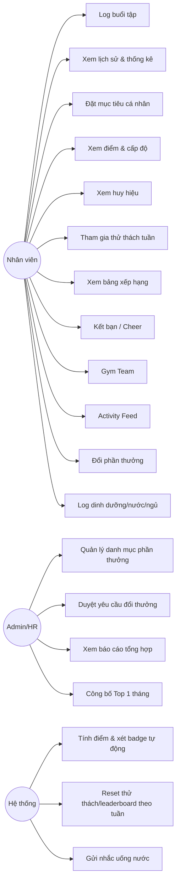

# Tổng quan Use Case — HealthStride

Sau khi đọc xong Business Understanding, đây là bước mình đi tiếp để trả lời "vậy hệ thống thực sự làm được những gì". Mỗi use case dưới đây ánh xạ tới một hành động cụ thể mà một actor có thể thực hiện.

> **Trạng thái**: Draft
> **Cập nhật lần cuối**: 2026-08-10
> **Owner**: BA/PM
> **Nguồn chính**: `business-understanding.md` (cùng bộ tài liệu)
> **Mức tin cậy tổng thể**: Trung bình

---

## 1. Tổng quan hệ thống

HealthStride phục vụ hai nhóm actor chính: **nhân viên** (người dùng trực tiếp mọi tính năng tập luyện, gamification, xã hội, phần thưởng, sức khỏe) và **quản trị viên HR/Admin** (quản lý danh mục phần thưởng, theo dõi tổng thể mức độ tham gia). Use case được nhóm theo 6 module tương ứng với các nhóm tính năng đã mô tả trong Business Understanding: Workout Tracking, Gamification, Social/Community, Reward, Health Tracking, và Admin.

## 2. Actor (tác nhân)

| Actor | Mô tả |
|---|---|
| Nhân viên (Employee) | Actor chính, dùng toàn bộ tính năng phía người dùng |
| Quản trị viên (Admin/HR) | Quản lý phần thưởng, xem báo cáo tổng hợp, công bố Top 1 tháng |
| Hệ thống (Scheduler) | Actor kỹ thuật — tính điểm, xét badge, reset thử thách/leaderboard theo lịch, gửi nhắc nhở |

## 3. Bảng tổng hợp Use Case

### Module Workout Tracking (WO)

| ID | Name | Primary actor | Goal | Pre-condition | Post-condition | Priority |
|---|---|---|---|---|---|---|
| UC-WO-01 | Log buổi tập | Nhân viên | Ghi nhận một buổi tập đã hoàn thành | Đã đăng nhập | Workout log được tạo, điểm được tính | Must |
| UC-WO-02 | Xem lịch sử & thống kê workout | Nhân viên | Xem lại các buổi tập đã log và số liệu tổng hợp | Đã có ít nhất 1 workout log | Hiển thị danh sách/thống kê | Must |
| UC-WO-03 | Quản lý danh mục bài tập (Squat, Deadlift, Yoga...) | Nhân viên | Chọn/tra cứu bài tập cụ thể khi log workout | Danh mục bài tập tồn tại | Bài tập được gắn vào workout log | Should |
| UC-WO-04 | Đặt mục tiêu cá nhân | Nhân viên | Thiết lập mục tiêu tuần/tháng (tần suất, giảm cân, tăng sức mạnh) | Đã đăng nhập | Mục tiêu được lưu, dùng để tính bonus điểm | Must |
| UC-WO-05 | Xem biểu đồ tiến độ | Nhân viên | Theo dõi calories burned, weight trend, tần suất tập | Có dữ liệu lịch sử | Biểu đồ hiển thị theo khoảng thời gian chọn | Should |

### Module Gamification (GM)

| ID | Name | Primary actor | Goal | Pre-condition | Post-condition | Priority |
|---|---|---|---|---|---|---|
| UC-GM-01 | Xem điểm & cấp độ hiện tại | Nhân viên | Biết tổng điểm, level, tiến độ lên cấp tiếp theo | Đã đăng nhập | Hiển thị điểm/level | Must |
| UC-GM-02 | Nhận & xem huy hiệu (badge) | Nhân viên | Xem các badge đã đạt và điều kiện các badge chưa đạt | Có workout log liên quan | Badge mới được cấp tự động khi đủ điều kiện | Must |
| UC-GM-03 | Tham gia thử thách tuần (Weekly Challenge) | Nhân viên | Theo dõi và hoàn thành thử thách để nhận thưởng | Thử thách đang mở trong tuần | Tiến độ thử thách cập nhật, thưởng khi hoàn thành | Should |

### Module Social & Community (SC)

| ID | Name | Primary actor | Goal | Pre-condition | Post-condition | Priority |
|---|---|---|---|---|---|---|
| UC-SC-01 | Xem bảng xếp hạng (Leaderboard) | Nhân viên | So sánh điểm/streak với đồng nghiệp | Đã đăng nhập | Hiển thị Top 10 và rank cá nhân | Must |
| UC-SC-02 | Kết bạn với đồng nghiệp | Nhân viên | Theo dõi hoạt động của bạn bè | Đã đăng nhập | Danh sách bạn bè cập nhật | Should |
| UC-SC-03 | Cổ vũ (Cheer) hoạt động của người khác | Nhân viên | Động viên đồng nghiệp sau buổi tập | Có hoạt động/bài đăng của người khác | Lượt cheer được ghi nhận | Should |
| UC-SC-04 | Tạo / tham gia Gym Team | Nhân viên | Cạnh tranh theo nhóm 3–5 người | Đã đăng nhập | Team được tạo hoặc thành viên được thêm | Should |
| UC-SC-05 | Xem & tương tác Activity Feed | Nhân viên | Theo dõi hoạt động toàn công ty, bình luận/reaction | Có hoạt động được đăng lên feed | Comment/reaction được ghi nhận | Must |
| UC-SC-06 | Xem tip & quote hàng ngày | Nhân viên | Nhận động lực và kiến thức tập luyện mỗi ngày | Đã đăng nhập | Nội dung ngày hiển thị trên Home | Could |

### Module Reward (RW)

| ID | Name | Primary actor | Goal | Pre-condition | Post-condition | Priority |
|---|---|---|---|---|---|---|
| UC-RW-01 | Xem danh mục phần thưởng | Nhân viên | Biết các mốc điểm và phần thưởng tương ứng | Đã đăng nhập | Danh mục hiển thị kèm điểm hiện có | Must |
| UC-RW-02 | Đổi điểm lấy phần thưởng | Nhân viên | Sử dụng điểm khả dụng để nhận quà | Đủ điểm khả dụng | Yêu cầu ở trạng thái "Chờ duyệt", điểm khả dụng bị trừ ngay, thứ hạng không đổi | Must |
| UC-RW-03 | Xem lịch sử đổi thưởng | Nhân viên | Theo dõi trạng thái các yêu cầu đã gửi | Đã có yêu cầu đổi thưởng | Danh sách lịch sử hiển thị | Should |
| UC-RW-04 | Quản lý danh mục phần thưởng | Admin/HR | Thêm/sửa/xóa phần thưởng và số lượng khả dụng | Có quyền admin | Danh mục cập nhật | Should |
| UC-RW-05 | Duyệt yêu cầu đổi thưởng | Admin/HR | Xác nhận và xử lý logistics phần thưởng | Có yêu cầu đang chờ duyệt | Trạng thái yêu cầu chuyển sang đã xử lý/từ chối | Should |
| UC-RW-06 | Công bố Top 1 tháng | Admin/HR | Xác định và trao thưởng người dẫn đầu tháng | Cuối kỳ tháng | Kết quả Top 1 được công bố, thưởng được ghi nhận | Should |

### Module Health Tracking (HE)

| ID | Name | Primary actor | Goal | Pre-condition | Post-condition | Priority |
|---|---|---|---|---|---|---|
| UC-HE-01 | Log lượng calories tiêu thụ | Nhân viên | Theo dõi dinh dưỡng hàng ngày | Đã đăng nhập | Nutrition log được tạo | Should |
| UC-HE-02 | Log nước uống | Nhân viên | Theo dõi tiến độ 8 cốc/ngày | Đã đăng nhập | Water log cập nhật, tiến độ ngày hiển thị | Should |
| UC-HE-03 | Log giấc ngủ | Nhân viên | Theo dõi thời lượng và chất lượng giấc ngủ | Đã đăng nhập | Sleep log được tạo | Should |
| UC-HE-04 | Nhận nhắc nhở uống nước | Nhân viên | Được nhắc định kỳ để đạt mục tiêu nước uống | Đã bật thông báo | Notification được gửi theo lịch | Could |

### Module Admin (AD)

| ID | Name | Primary actor | Goal | Pre-condition | Post-condition | Priority |
|---|---|---|---|---|---|---|
| UC-AD-01 | Xem báo cáo tổng hợp tham gia | Admin/HR | Đánh giá mức độ tham gia phong trào toàn công ty | Có dữ liệu hoạt động | Báo cáo hiển thị theo kỳ | Should |
| UC-AD-02 | Nạp danh sách nhân viên hợp lệ | Admin/HR | Kiểm soát ai được phép sử dụng ứng dụng | Có quyền admin | Danh sách nhân viên cập nhật, tài khoản nghỉ việc bị vô hiệu hóa | Must — `[DECISION]` D-004 |
| UC-AD-03 | Cấu hình quy tắc điểm/badge/level | Admin/HR | Điều chỉnh cơ chế gamification theo thời gian | Có quyền admin | Quy tắc mới áp dụng cho các hoạt động tiếp theo | Ngoài phạm vi MVP — công thức D-001/D-002 cấu hình ở tầng hệ thống |

## 4. Sơ đồ Use Case (Mermaid)

## 5. Đối chiếu Use Case ↔ Màn hình (draft)

Xem chi tiết đầy đủ tại `screen-flow.md`. Tóm tắt nhanh:

| Use case | Screen ID (dự kiến) |
|---|---|
| UC-WO-01 Log buổi tập | SCR-WO-11 |
| UC-WO-02 Xem lịch sử & thống kê | SCR-WO-10, SCR-WO-14 |
| UC-GM-01 Xem điểm & cấp độ | SCR-HOME-10, SCR-GM-11 |
| UC-SC-01 Xem bảng xếp hạng | SCR-SC-10 |
| UC-RW-02 Đổi phần thưởng | SCR-RW-10, SCR-RW-11 |
| UC-HE-02 Log nước uống | SCR-HE-11 |

## 6. Câu hỏi mở / Mâu thuẫn (Open questions / conflicts)

Không phát sinh conflict mới ở tầng use case. Các câu hỏi ảnh hưởng trực tiếp đến phạm vi use case đã được ghi trong `business-understanding.md` §14 (đặc biệt Q-001 đến Q-005, Q-009, Q-012 ảnh hưởng đến độ chính xác của các use case Reward và Social).
